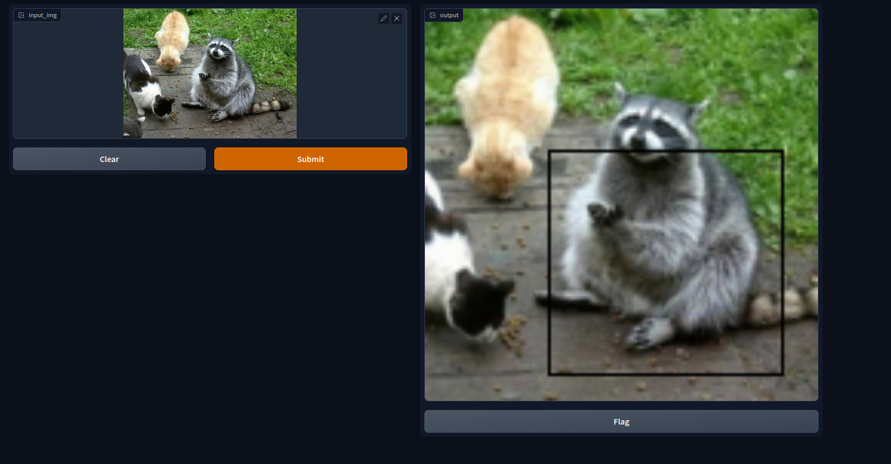

# racoon-O-vision
Racoon-O-Vision is a racoon detection application made within the context of a data-engineering courswork.
The aim of the application is to detect wether or not a racoon is present on a picture, and in this case, localize it, higlighting the animal in a squared box.

A Faster R-CNN model has been used for the sake of object detection task, trained on the [racoon dataset](https://www.kaggle.com/datasets/debasisdotcom/racoon-detection/code) from Kaggle.



## Setup with Poetry

Poetry is a package and dependecy managment tool, more about it [here](https://python-poetry.org/)

```sh
$ pip install poetry
```
```sh
$ poetry add 
$ poetry build 
```
